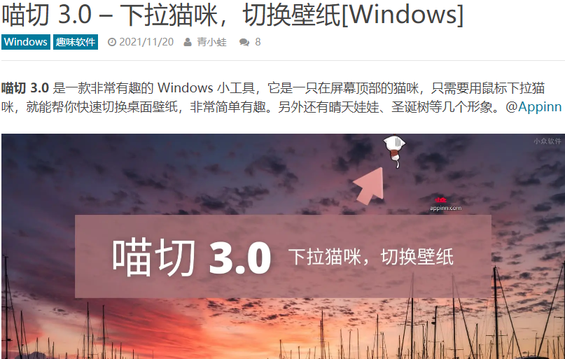

# catswitch

程序名：喵切 

#### 软件名的由来

Seraga：猫咪切换壁纸，就叫猫切或者cat switch

mo细米粒 评论道：喵切 怎么样，谐音“秒切”，还更可爱一点

#### 图标

Seraga提议用clash那种单色猫头

我觉得Milgrad的那只猫猫挺可爱的就暂时借用了

#### 食用说明：

软件会显示在屏幕上方5分之4的位置，不可拖拽改变位置

鼠标左键下拉小猫，检测下拉y值，大于20，即可触发切换壁纸

#### 壁纸更换方式

在 list.txt 里自定义壁纸图源，可以是本地图片，或是网络图片链接。

4.1版本后增添切换壁纸源功能

#### 皮肤diy

不喜欢内置几款皮肤的同学，还可以在 skin 文件夹下，新建一个文件夹，制作软件皮肤的图片。

皮肤图片格式是含透明通道的png图片，大小不限，命名按 0.png，1.png … 4.png 一共五张图，0.png 是初始状态图，1-4 是下拉时模拟动画的图。

右键菜单里会自动识别 skin 文件夹里皮肤图包的文件名，自动添加到皮肤选项里。

---

v4.1更新内容

增添 切换壁纸源功能

v4.0更新内容

增添开机自启功能

增添桌面快捷方式功能

增添自动获取壁纸路径，批量添加壁纸功能，并添加模式转换

增添设置默认起始皮肤功能

小改：将img文件夹改名为skin，存放皮肤文件